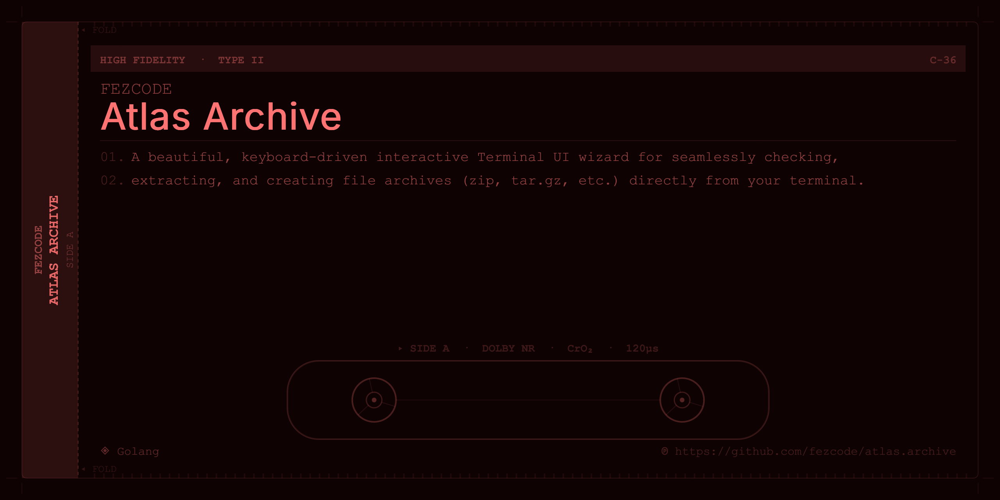

<div align="center">

# 📦 Atlas Archive



**A beautiful, interactive Terminal User Interface (TUI) for extracting and creating archives.**

[](https://golang.org/doc/devel/release.html)
[](https://opensource.org/licenses/MIT)
[](https://github.com/charmbracelet/bubbletea)

</div>

---

## 🌟 Overview

**`atlas.archive`** is an elegant, keyboard-driven utility that takes the pain out of managing compressed files. Whether you are zipping up project directories or extracting nested `.tar.gz` and `.zip` files, it empowers you with a simple, step-by-step interactive workflow.

Built with Golang and the stunning [Charm](https://charm.sh) ecosystem (`bubbletea`, `lipgloss`, `bubbles`), it brings the aesthetics of a modern graphical user interface directly into your fast-paced terminal workflow.

## ✨ Features

- **Interactive File Picker**: Visually navigate through your file system, toggling multiple items with the `Space` bar for customized archive packing.
- **Flawless Formatting**: Choose seamlessly between a wide range of modern compression formats (`.zip`, `.tar.gz`, `.tar.bz2`, `.tar.xz`, `.tar`).
- **Context-Aware Steps**: The TUI automatically tailors its wizard menus based on whether you are *Extracting* or *Archiving*.
- **Premium Aesthetics**: Experience amber highlights, responsive progress tracking, smooth cursor indicators, and contextual hotkey breadcrumbs.
- **Robust Engine**: Powered by `mholt/archiver/v3`, assuring performant and reliable stream compression mapping.
- **Multi-Platform Ready**: Integrates with [`gobake`](https://github.com/fezcode/gobake), delivering instant cross-compilation capability for Linux, Windows, and macOS architectures smoothly.

## 🚀 Installation

Ensure you have Go installed on your machine.

**Install directly via Go**:
```bash
go install github.com/fezcode/atlas.archive@latest
```

**Build from Source using gobake**:
```bash
git clone https://github.com/fezcode/atlas.archive.git
cd atlas.archive

# If you have gobake installed:
gobake build
```

## 🎮 Usage

Simply initialize the TUI in any directory:
```bash
atlas.archive
```

### Hotkeys & Navigation
| Key | Action |
| --- | --- |
| `↑` / `k` | Move cursor up |
| `↓` / `j` | Move cursor down |
| `←` / `h` | Move to parent directory (File browser) |
| `→` / `l` | Enter into directory (File browser) |
| `Space`   | Toggle file selection when Archiving |
| `Enter`   | Confirm selection / move to next step |
| `Esc`     | Go back to the previous menu |
| `Ctrl+C`  | Abort completely |

## 🛠️ Architecture

- **`main.go`**: Command line entry point and helper flag evaluations (`-h`, `-v`).
- **`internal/tui/model.go`**: Core state machine handling wizard transitions asynchronously.
- **`internal/tui/styles.go`**: UI styling components utilizing `lipgloss`.
- **`recipe.piml` & `Recipe.go`**: Gobake build system configuration instructions.

## 📄 License

This project is licensed under the MIT License - see the `LICENSE` file for details.
